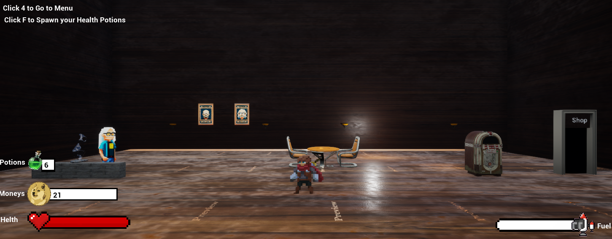

# **PROJECT JUMP**

## B team : **Gravity Grippers**

### Contact Info: hengstler2005@gmail.com

---

# Table of Contents
1. [Project Overview](#project-overview)
   - [Purpose of Product ](#purpose-of-product)
   - [Target Audience](#target-audience)
   - [Theme](#theme)
   - [Goals](#goals)
2. [Flow of the Game](#flow-of-the-game)
3. [Game Features](#game-features)
   - [HUD](#hud)
   - [Dynamic Level Generation](#dynamic-level-generation)
   - [Interactable Objects](#interactable-objects)
   - [Comprehensive Control System](#comprehensive-control-system)
   - [Shop and Currency System](#shop-and-currency-system)
   - [Procedural Level Generation](#procedural-level-generation)
   - [Dynamic Difficulty](#dynamic-difficulty)
   - [Event Handling and Game Mechanics](#event-handling-and-game-mechanics)
   - [Special Songs](#special-songs)
4. [Game Rules/Mechanics](#game-rulesmechanics)
   - [Game Save Dynamics](#game-save-dynamics)
   - [Gameplay Challenge and Progression](#gameplay-challenge-and-progression)
   - [Guided Gameplay Through Specifications](#guided-gameplay-through-specifications)
   - [Tower Boundaries](#tower-boundaries)
   - [One Way Platform Mechanic ](#one-way-platform-mechanic)
   - [Jetpack Usage and Fuel Management](#jetpack-usage-and-fuel-management)

5. [Game Levels Overview](#game-levels-overview)
   - [Main Tower](#main-tower)
   - [Shop](#shop)
6. [Key Items](#key-items)
   - [Main Player](#main-player)
   - [JetPack](#jetpack)
   - [Basic Spike Trap](#basic-spike-trap)
   - [Turret](#turret)
   - [Health Potion](#health-potion)
   - [chest](#chest)
   - [Jukebox](#jukebox)
7. [Priority Levels](#priority-levels)
   - [Core](#core)
   - [Secondary](#secondary)
   - [Nice to Have Features](#nice-to-have-features)
8. [Non-Functional Requirements](#non-functional-requirements)
   - [Performance Requirements](#performance-requirements)
   - [Software Quality Requirements](#software-quality-requirements)
   - [Safety and Security Requirements](#safety-and-security-requirements)
9. [Summary](#summary)

## Product Overview.

  **Purpose Of The Product:**

  "Tower of Dave" is designed as an engaging and dynamic video game that combines elements of adventure, strategy, and skill. The core purpose of this product is to offer players an immersive and challenging gaming experience where they navigate through various levels, interact with different game elements, and overcome obstacles. The game leverages 2D and 3D elements, blending traditional platforming with modern game mechanics. It is single player game that can be enjoyed by a wide range of people.

  **Target Audience:**

  The game is targeted toward a broad audience, appealing to both casual and dedicated gamers. It is especially attractive to those who enjoy platformers, adventure games, and games with strategic elements. The game's intuitive mechanics make it accessible to new players while its depth and variety of challenges cater to more experienced gamers.
 
  **Theme:**

The theme of "Tower of Dave" is a whimsical and adventurous ascent through various levels of a fantastical tower. The game world is vibrant and lively, featuring unique art styles and imaginative environments. The theme blends elements of fantasy with a touch of the surreal, creating an engaging and visually appealing setting. It is a 2d vertical procedurally generated platformer with a 3d art style for most elements, giving it a unique look. It also includes various mechanics that enhance gameplay, such as health and abilities, with a fully functional shop. The core gameplay is unlocking new abilities and items by buying them through the shop.

  **Goals:**
 
The primary goal for players is to navigate through the levels of the tower, overcoming obstacles, while collecting coins and health potions. Players aim to reach the highest levels of the tower, facing increasing challenges and complexity as they progress. The game also encourages exploration and interaction with various game elements to unlock boxes, collect coins, and use Jukebox to play some wonderful songs while they playing.

 Secondary goals include:

- Improve procedural generation by making a level based system which deletes levels when loading a new one

- Set up a shop for the user to buy from with a UI and items/power ups

- Implement two to 4 abilties for the player to use

- Add custom blocks and further change how the map generates

- Add basic traps.

- Set up a function HUD with key elements.

 

2. ## Flow of the game.

 

Players start at the base of the tower and progress upward by jumping through the platforms to reach various levels. These platforms will be generated by an algorithm specified below, randomly generating but meeting a specific pattern and they will become more sparsely spawned as the levels progress. Each level features unique challenges, including platforms, enemies, traps, and interactable objects. Players collect items and power-ups and engage in interactions with characters and objects that influence their journey. The game also has a fall damage mechanic which removes the player's health when they fall for longer than a certain amount of time, based on how long they fall, which acts as the main death mechanic. When the player dies, the game is over and the player gets sent back to the bottom. Every run the player earns coins based on height traversed, which can be used in the shop to buy abilities and extra health, before starting the next run. The game's difficulty and complexity increase as players ascend the tower, introducing new mechanics and challenges.

 

3. ## Game Features.

 

 **HUD.**
 The player will have a Heads Up Display on their screen, which shows their score/ or currency and their health. It will also include their abilities The HUD will also change when interacting with the shop, and when raytracing an interactable object. The HUD is layerable and other layers will be added when needed.

 
 **Dynamic Level Generation:**
Each level is uniquely generated, offering a fresh experience with each playthrough.

 **Interactable Objects:**
 Including chests for random rewards, jukeboxes for music interaction, and various traps and enemies.

 **Comprehensive Control System:**
Intuitive controls for movement, interaction, and special abilities.

 **Shop and Currency System:** 
Players can collect coins as they progress through levels, encountering chests and defeating enemies. These coins can then be spent in the shop between levels to purchase permanent stat upgrades, consumable power-ups, cosmetic items, and other bonuses. This acts as a risk/reward progression system.

 **Procedural Level Generation:** 
Each level is uniquely generated at runtime based on algorithmic rules, ensuring no two playthroughs are the same. Levels get progressively more challenging as the player ascends higher.

 **Dynamic Difficulty:** 
Gameplay is adapted in real-time based on player performance. Challenges increase or decrease accordingly to provide an engaging experience for all skill levels.

 **Event Handling and Game Mechanics**
Complex interactions and events that keep gameplay engaging and varied.

 **Special songs**
VIU celebrity becoming the game's DJ, recording unique songs for each level that players can listen to while playing using the jukebox. This adds to the whimsical theme and encourages exploration.

4. ## Game Rules/Mechanics.

  **Rules.**

**Game Save Dynamics**

The game automatically saves progress whenever the player enters or exits the shop. This feature ensures that players don't lose their progress and can pick up where they left off, especially important after accessing the shop for upgrades or items.

**Gameplay Challenge and Progression**

The game is designed in such a way that completing the tower jumps using only the jump mechanic is not guaranteed. This design encourages players to become proficient with the jetpack, adding an extra layer of skill and strategy to the gameplay.
 
 **Guided Gameplay Through Specifications**

Specific restrictions and specifications for each game component or mechanic are carefully crafted to guide players into understanding and following the rules of the game. This approach helps to create an intuitive and engaging gameplay experience. 
 

  **Mechanics.**

**Tower Boundaries**

Players are restricted from exiting the tower's boundaries to the left and right of the platform. Physical constraints within the game map enforce this, ensuring that gameplay remains focused within the designated area of the tower.

**One Way Platform Mechanic**

Once players progress through a one-way platform to a new level, they cannot go back down to the previous level. This mechanic ensures continual progression and controls player movement, focusing them on their current level and the challenges that lie above.

**Jetpack Usage and Fuel Management**

The jetpack, a crucial element for navigating the game, ceases to function when it runs out of fuel. Players must strategically acquire more fuel to continue using the jetpack, adding a resource management aspect to the game. This mechanic not only enhances the game’s complexity but also intertwines with the strategic planning of the player's ascent through the tower.

5. ## Game Levels Overview
### Main Tower

 **Core Gameplay Area** 

The main tower is the central gameplay area where the player spends most of their time. It's where the primary action of climbing and navigating through various platforms takes place.

 **Randomly Generated Platforms**

Platforms within the tower are generated using an algorithm, ensuring a unique experience with each playthrough.
The generation algorithm places platforms across the tower's width, within the boundary walls, at set interval heights.
The spacing and height of platforms are designed such that players can reach the first level with a low-powered jump and the second level with a full-power jump.This pattern continues throughout the tower, providing consistent challenge and progression.

 **Platform Generation Specifications**

The tower has boundary walls on both sides, keeping the player within the main play area.
A maximum number of blocks per level is set, controlling the density of platforms.
An adjustable variable introduces randomness in platform spawning, affecting level difficulty.
A minimum number of blocks per level ensures that each level is achievable.

**Object Spawning:**
 Each platform will have a ¼ chance of spawning a socket on each platform as it spawns. This will require the socket implementation to take place inside the random platform generator construction script.
The pickups and objects will have the following chances of spawning on a socket that spawns. As each object chance is not activated then it is cascading into the chance of the next object spawn:
¼ chance of spawning socket.
⅛ chance for spike trap.
1/10 chance for turret.
½ chance for health potion
⅔ chance for chest
1/1 chance for coin if it reaches this point.

 **Level Progression Mechanism**

The game implements an "interact" feature, triggering level spawning when the player interacts with specific objects, like a door. A dynamic three-level system keeps the player centered, with seamless transitions between levels.To manage the sky limit and resource usage, the game might move everything down the Z-axis, creating an illusion of continuous upward movement.

 **Gameplay Objective**

Players jump from platform to platform, gaining score and currency, which can be used in the shop to purchase abilities enhancing their high-score potential.

 ### Shop

 **Location and Access** 

 This is present at the start of the tower, and the player can go here to buy abilities and items. Players enter it by going through a door on the base level of the tower, which loads the Shop scene/level. This scene/level will look somewhat like a tavern or bar, with the DaveWessel intractable pawn behind a counter. 

 **Environment and Theme**

 The Shop scene resembles a tavern or bar, featuring the interactable pawn, DaveWessel, behind a counter.

 **Functionality and Interaction**

***DaveWessel:***  As an interactable pawn, Dave facilitates the shopping experience.

***OnInteract Function:*** When the player uses the interact function (ray tracing and clicking on Dave), a UI for the shop appears, accompanied by Dave Wessel's voice lines. 

***Jukebox*** - An interactable object that when interacted with, swaps the main camera of the player to a camera zoomed in on the screen of the Jukebox. It opens a UI that shows buttons to play different songs, a title, an exit button, and the name of the current song playing, it also stops the player from moving by changing CanMove to false. Upon clicking the interact keybind again, or clicking the exit UI button, the camera will swap back to the player's camera, the Jukebox UI will be hidden, and CanMove is changed to true. This Jukebox plays AI renditions of Your Welcome, Cupid, Revenge, and Party in the USA and is located inside of the shop. 

***Purchasing Mechanism**** Items and power-ups are purchased through the shop UI, using in-game currency. When an item is selected, and the player has enough currency, the transaction occurs, and the player receives the item, losing the corresponding amount of currency.

6. ## Key Items.

  **Main Player.**
 
 This is the player of the game. It is a 2d sprite with basic animations and a charge jump mechanic. The movement is all done using blueprints, and the larger functions such as interact handling are handled in C++. The player has a jump strength for the max his jump can charge to, health, maxHealth, and currency for purchasing upgrades at the shop. The player will also have an inventory where it will store consumable items, and powerups/abilities

**Jump Mechanic:**

The Jump Mechanic is implemented in blueprints and utilises the jumpStrength variable. It checks that the player is able to jump by checking if they are connected to solid ground, then it checks if it is in a place where it can jump. It launches the player based on how long the button SPACE is held down to a max of jumpStrength, another variable called airControl changes how much the player can move in the air. Jump should be in a parabola pattern. When charging the jump, player should not be able to move around, therefore only a slight X-axis movement should be possible based on the player moving left or right while airborne, this will be called airControl. Max jump should be roughly 4-5 times the height of the player sprite in order to be more easily controlled and not jump out of visual range of the camera. 

**Interact Mechanic:**

The interact mechanic has two main functions being CheckInteract(), and Interact.
Checkinteract is called every tick, and allows the player to call Interact if it detects a valid object on its raytrace.

**CheckInteract** - This is called every tick, it creates a raytrace that hits an object directly behind the player. If the object hit has the Interactable tag, then it allows the player to call the interact function by using the interact button. It also adds the interact UI that shows the player that they can interact right now.

**Interact** - When the player hits the interact button and there is a valid object ratraced, then it accesses the interactables function OnInteract and calls it. 

**Powerups/Abilities and Inventory:** The inventory will either be a map, or an array of items. Currently the abilities include the jetpack, and potion spawn. These are all purchased through the DaveWessel shop using currency.

**Variables:**
    Health - Will be changed from falling, health potions, and possibly enemies. Will never go under one or over maxHealth
    maxHealth - Starts at 100, changes based on upgrades
    Currency - Will be gained from increasing Y value of player, and possibly collecting items from chests and destroying enemies. The currency will be used at the shop where you can purchase upgrades and items. This shop will be accessed through the interactable DaveWessel object, costs will be determined later.
    Powerups/Inventory:
    jumpStrength - Chosen by developer, used in Jump Mechanic
    airControl - Chosen by developer, used in Jump Mechanic
    Fuel - Chosen by developer, depleted by holding space when using jetpack
    numPotion - Starts at 5, decremented each time a potion is used and increased when purchased from the DaveWessel Shop
  **JetPack:**
This is one of the abilities purchasable in the game. It runs on limited fuel which can be refilled with pickups present in the map, and allows the player to fly up, or negate fall damage if they miss a jump. 
The jetpack only works once you buy it from the shop, and can be activated while the player is in mid-air by holding down space, or tapping it for short boosts.

**Potion Spawn:**
Spawns a Health Potion object in front of the player if NumPotions>0, decrements NumPotions by 1. 

**Variables:**
Hovering?:Boolean value to store status of player, if the player is in air or not.
Fuel - Chosen by developer, decremented each time jetpack is used.
Thrust - Chosen by developer, used to boost player upwards
 
**Basic Spike Trap.**
An actor object that deals 25 damage to the player using the ApplyDamage function from the Player Blueprint when the player overlaps the trap. If the player touches it and stays on the spike trap, there will be no extra instances of damage, the damage should only be administered once every time the player walks on to it. The generation of spike traps in the world is handled by the random platform spawner.

 **Health Potion:**
A Health Potion is a pickup object that heals the player when used. The player can buy potions from the shop and then spawn them in game by pressing a key, which will spawn a health potion item in front of the player which gets destroyed when the player walks over it, and heals the player for a set amount of health.

 **Turret:**
An actor that uses an Unreal Engine Pawn Sensing component to detect when the player is in front of it. The sensing area is an inverted cone with a radius of 600 units pointing in front of the turretUpon detecting the player, the turret fires spheres/bullets at the player every .8 seconds that deal 5 damage to the player using the Player Blueprint Apply Damage function. The bullets will disappear upon hitting anything in the level, and are fired with an initial velocity of 800 units/s. The generation of turrets in the world is handled by the random platform spawner.

 **Chest:**
An interactable object that inherits from the interactables class that when interacted with, gives a random integer amount of money between 35-100 to the player by directly adjusting the wallet variable. It also displays the amount of money gained above the chest via text render component for 2 seconds, after that it destroys itself using the Destroy() function and disappears. The generation of chests in the world is handled by the random platform spawner. The chest interacts directly with the player to change the wallet, and with the world so it can be generated.

 **Jukebox:**
An interactable object that inherits from the interactables class and when interacted with, checks a boolean called bIsInteracting, if it is false it swaps the main camera of the player to a camera zoomed in camera on the screen of the Jukebox. It opens a UI called Jukebox UI that shows buttons to play different songs, a title, an exit button, and the name of the current song playing, and stops the player from moving  by changing CanMove to false. The buttons that play songs will upon being clicked, first check to see if there is a song playing, if not it will play it’s song by spawning a 2D audio object so that it plays while the player wanders around the scene, and update the current song text box to the name of its song. If there is currently a song playing, it will stop the song, play its song and change the current song text box to the name of its song.
If the interact keybind is clicked when bIsInteracting is true, or clicking the exit UI button, this means that the player is currently using the Jukebox and the camera will swap back to the player's camera, the Jukebox UI will be hidden, and CanMove bool is changed to true.It plays AI renditions of Rich Girl, Johnny B Goode, Lose Yourself, and Levitating. This is spawned on the left side of every OneWayPlatform, as well as the base level of the game.

## Priority Levels.

  **Core**.

The core features are the procedural generation, the HUD, and a crude shop with one ability, and an option to buy extra health/health potions, the player health and death mechanic and currency to spend in the shop. The purpose of our game is so that the user is rewarded when they reach higher and higher up the tower, accumulating currency that they can spend after they die when they respawn at the base level of the tower and head to the shop. The game will store your current score value and convert it to currency upon reset.

  **Secondary.**

The secondary features include a well designed shop, with more abilities, better procedural generation (obstacles in the way or to stand on), more refined textures for the tower and background, music for the game, particle effects, basic traps and different platform types.

  **Nice to have features.**

More abilities, multiple levels, more platform types, bosses, more traps would be nice to have in the game, as they would improve gameplay a lot.

Potential abilities: Dash, Grappling hook, portal
Levels: “boss level”, low gravity level, dark room level
Platform Types: slippery, sticky, bouncy, fake
Bosses: Either an actual entity that chases you and hurts you or just a level with increased traps and projectiles.
Traps: Fake platforms, spikes, ray tracing projectile, Barriers that you bounce off of.
Shop: Dave Wessel gets angry at you if you try to buy something without enough money

8. ## Non-Functional Requirements.

  **Performance Requirements.**

Cross-Platform Compatibility:

The game must function smoothly on all modern PC operating systems. This ensures a wide accessibility and uniform gaming experience across different platforms.
If feasible, the game should also perform well on other platforms, expanding its reach and availability.

System Compatibility:

The game, built using Unreal Engine 5, should be capable of running efficiently as an executable file on the specified systems. This involves optimizing the game to be compatible with the capabilities and limitations of modern hardware.

  **Software Quality Requirements**.
Ensure production ready code has been thoroughly tested and running without bugs.

Testing and Debugging:

Rigorous manual playtesting is essential after each function implementation. This process helps identify and rectify bugs, enhancing overall game quality.
Continuous testing is vital to ensure a stable and bug-free gaming experience.

Coding Standards and Practices:

Adherence to standard coding conventions and programming practices is required to minimize issues like spaghetti code, memory leaks, and other potential errors.
Programmers are expected to uphold high-quality standards in their work, contributing to the robustness and reliability of the software.

  **Safety and Security Requirements.**
Limited Security Concerns:

Given the nature of the game as a small-scale project with no online play, extensive security measures are not a primary concern.The focus is on ensuring that the game does not compromise the safety or integrity of the user’s system.

Compatibility and Safety:

The game should be designed to align with the specifications of modern operating systems, ensuring safe operation on user machines without causing system issues.

9. ### Summary
In summary, "The Tower of Dave" aims to deliver a high-quality gaming experience across various PC platforms, adhering to performance, quality, and safety standards. While performance focuses on cross-platform compatibility and smooth operation, quality requirements emphasize rigorous testing and adherence to coding standards. Safety and security are ensured through system compatibility and the absence of extensive security needs due to the game's offline nature.
